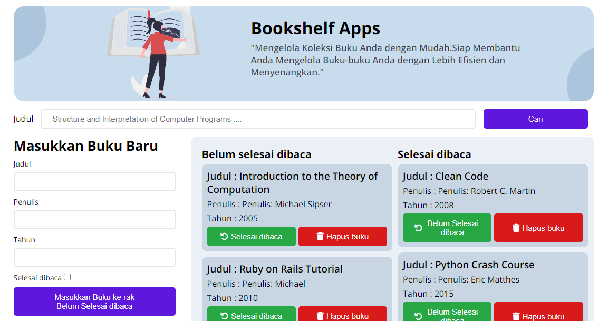
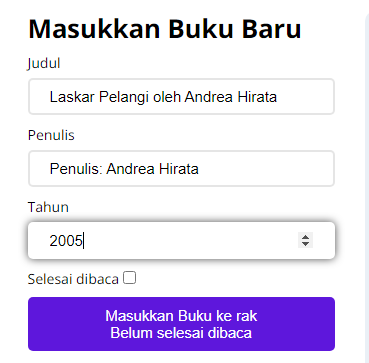
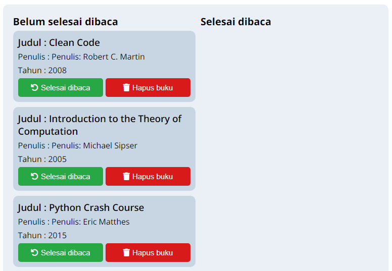
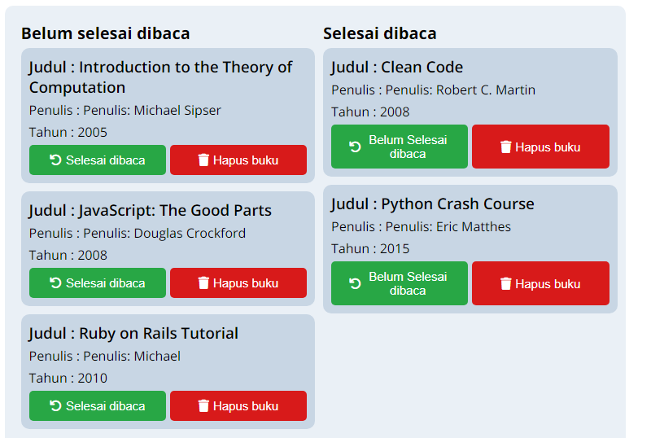
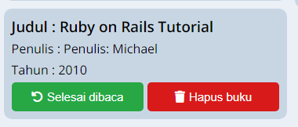
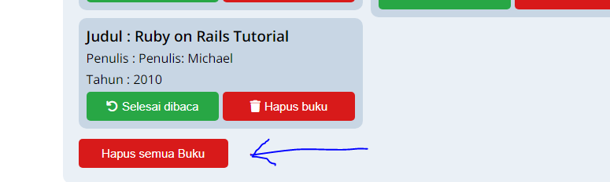
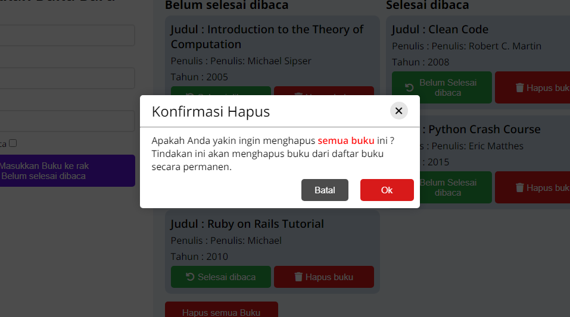
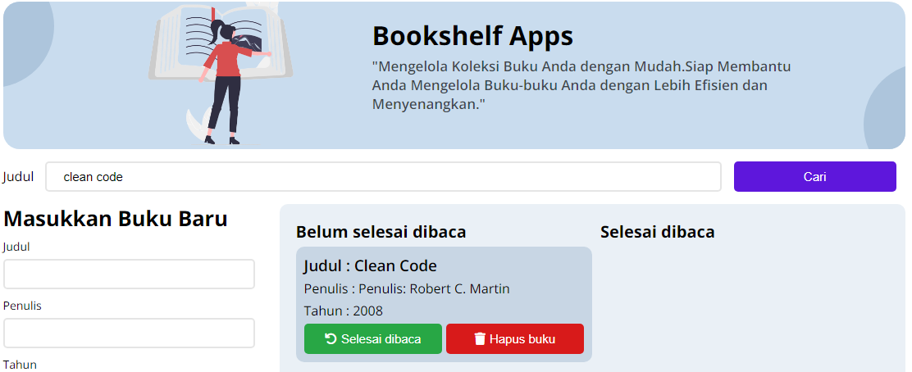

# Bookshelf-Apps
Submission Dicoding course - Membuat Aplikasi Pengelolaan Data Menggunakan DOM dan Web Storage - Kelas Belajar Membuat Front-End Web untuk Pemula.
Aplikasi Bookshelf adalah sebuah platform yang memungkinkan Anda untuk mengatur dan melacak koleksi buku Anda. Dengan aplikasi ini, Anda dapat dengan mudah menambahkan buku baru, memperbarui status buku (sudah dibaca atau belum), membaca daftar buku, menghapus buku satu per satu, atau menghapus seluruh koleksi buku Anda.

## Cara Menggunakan
    https://github.com/anggernuramin/-Bookshelf-Apps.git
1. Clone repositori diatas ke komputer Anda.
2. Buka folder aplikasi.
3. Buka file `index.html` di browser Anda.
4. Anda sekarang dapat menggunakan Bookshelf App untuk mengelola daftar buku Anda.

## Fitur Yang Anda Dapatkan
## A. Menambahkan Buku Baru
  Untuk menambahkan buku baru ke koleksi Anda, ikuti langkah-langkah berikut:
1. Isi informasi buku seperti judul, penulis, tahun, dan status baca ( Untuk input judul,penulis dan tahun `harus terisi` ).
2. Klik Button "Masukkan Buku ke rak" untuk menambahkan buku ke koleksi Anda.
3. Sebelum Klik Button "Memasukkan Buku ke rak" pastikan apakah buku ingin dimasukkan Buku ke rak Belum Selesai Dibaca atau Selesai Dibaca dengan memanfaatkan fitur `checbox`
Tampilan Button jika ingin "Memasukkan Buku ke rak Belum Selesai Dibaca" (nilai default)

## B. Memperbarui Status Buku
  Anda dapat memperbarui status baca buku dengan mudah:
1. Temukan buku yang ingin Anda perbarui di daftar buku.
2. Klik tombol "Selesai Dibaca" `Button Berwarna Hijau` jika Anda telah menyelesaikan buku tersebut, atau "Belum Selesai Dibaca" jika belum.
3. Maka akan secara otomatis pindah sesuai dengan subjudul buku.
   

## C.Membaca Daftar Buku
 Daftar semua buku dalam koleksi Anda dapat dilihat di halaman utama aplikasi. 
 Buku-buku yang telah selesai dibaca akan ditandai dengan status "Selesai Dibaca."
 

##  D. Menghapus Buku
 Untuk menghapus satu buku dari koleksi Anda:
1. Temukan buku yang ingin Anda hapus di daftar buku.
2. Klik tombol "Hapus Buku." `Button Berwarna Merah`
   

## E. Menghapus Seluruh Koleksi
 Anda dapat menghapus seluruh koleksi buku Anda dengan cepat:
1. Klik Button "Hapus semua Buku" `Button Berwarna Merah` di bawah daftar buku.
2. Dengan begitu maka daftar buku akan dihapus secara permanent.  `Data Buku yang ada di Web Storange akan dihapus semua`
   

## F. Konfirmasi Penghapusan
1. Setiap kali Anda menghapus buku atau seluruh koleksi 
2. Anda akan diminta untuk mengkonfirmasi penghapusan. 
3. Pastikan untuk memastikan bahwa Anda benar-benar ingin menghapus buku-buku tersebut tekan Button Ok `Button Berwarna Merah`  dan jika masih ragu-ragu tekan Batal  `Button Berwarna Abu-abu`

## G. Mencari Buku
 Anda dapat menggunakan fitur pencarian untuk dengan cepat menemukan buku tertentu dalam koleksi Anda. 
Di halaman utama aplikasi, temukan kolom pencarian yang terletak di bagian atas.
1. Ketikkan judul buku, penulis, atau informasi lainnya yang ingin Anda cari.
2. Hasil pencarian akan ditampilkan di bawah kolom pencarian.
3. Namun jika buku yang anda cari tidak ada maka secara  `default` menampilkan semua list buku
Dengan fitur pencarian ini, Anda dapat dengan mudah menemukan buku dalam koleksi Anda tanpa harus melihat seluruh daftar.

## H. Menyimpan Data ke Local Storage
Aplikasi Bookshelf secara otomatis menyimpan koleksi buku Anda menggunakan `Local Storage`. 
Ini berarti data Anda akan tetap ada bahkan setelah Anda menutup aplikasi atau `mematikan perangkat Anda`.

Dengan panduan ini,Diharapkan Anda sekarang memiliki pengetahuan lengkap tentang cara menggunakan aplikasi Bookshelf. 
Selamat menikmati mengatur koleksi buku Anda!
   
